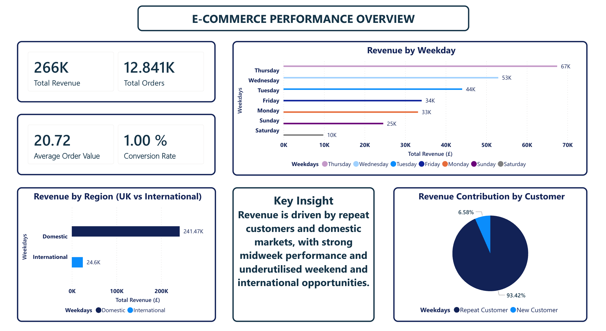
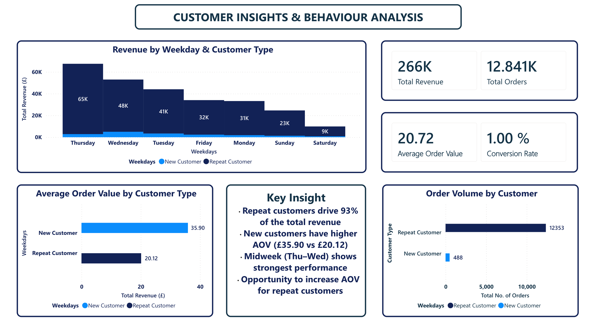
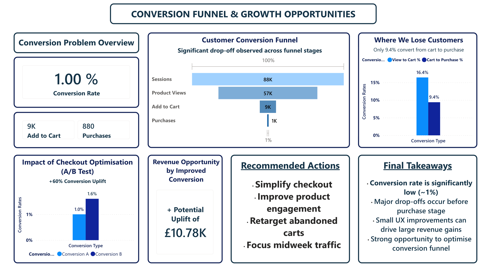
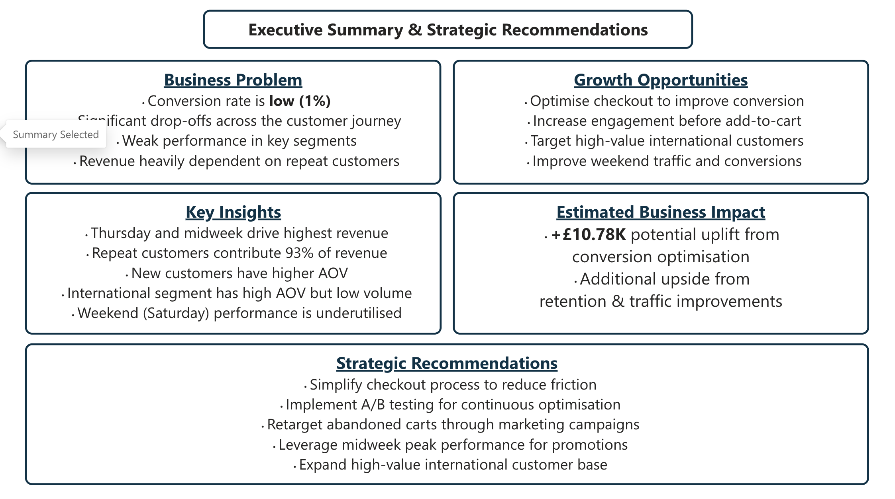

# E-Commerce Data Analysis Dashboard

An end-to-end business intelligence project analysing customer behaviour, conversion funnel, and revenue optimisation opportunities using Power BI.

---

## Dashboard Preview

### Overview

### Customer Analysis

### Conversion Funnel

### Executive Summary

(How to add images in this parts?)
---

## Business Problem

- Conversion rate is low (1%)
- Significant drop-offs across the customer journey
- Weak performance in key segments
- Revenue heavily dependent on repeat customers

---

## Objectives

- Analyse customer behaviour
- Identify revenue drivers
- Evaluate conversion funnel
- Recommend growth strategies

---

## Key Insights

- Repeat customers contribute ~93% of revenue
- Midweek drives highest performance
- New customers have higher AOV
- International segment underutilised
- Weekend sales are low

---

## Recommendations

- Simplify checkout process
- Improve product engagement
- Retarget abandoned carts
- Leverage midweek traffic
- Expand international segment

---

## Business Impact

- Estimated uplift: **£10.78K**
- Additional growth opportunities identified

---

## Tools Used

- Power BI
- DAX
- Excel

---

## Dataset

- https://archive.ics.uci.edu/ml/datasets/Online+Retail  
- https://www.kaggle.com/datasets/vijayuv/onlineretail  

---

## Author

Mannan Hakim  
MBA | Data Analyst
LinkedIn: www.linkedin.com/in/mannan-hakim-aa654a250
